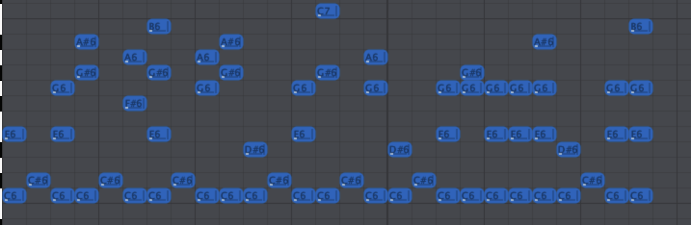
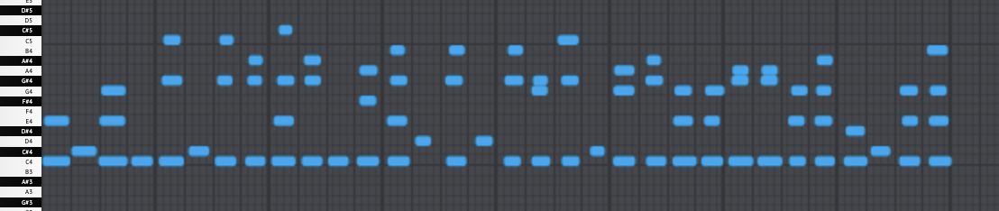

# Polyphony - A MIDI Based Esolang

## Table of Contents
### [Overview](#overview)
### [Syntax Semantics and Grammar](#syntax-semantics-and-grammar)
### [Examples](#examples)
### [Setup](#setup)

## Overview
Polyphony is an interpreted concatenative stack based language that is written using MIDI files. Inspiration for the language design stem from languages like Forth, Joy, and uiua.

Polyphony only supports one type of literals: 64 byte integers (`int64_t`). This was done to reduce the complexity of the 

In general, there are certain chords reserved as keywords. For our purposes, a chord is defined as 2 or more notes played simultaneously (Take care that one note can be part of multiple chords depending on its length and overlap with other notes). If a chord that is not recognized as a keyword is played, the highest note of the chord will be used as the literal. Outside of this, single notes are considered as literals.

Polyphony operates on a base 12 number system. Each semitone represents a digit, with `C` being `0` and `B` being `11`. The octave doesn't matter so both `C#4` and `C#5` represent 1. 

As opposed to being identified by the specific notes in a chord, chords are identified by the intervals between its notes (More specifically, the amount of semitones between any 2 consective notes of a chord as opposed to intervals based on scales). From now on, we will represent a chord by its intervals. ex: an octave is written as `(13)` and the chord `CC#E` is written as `(2,4)`. In case it is not obvious these are written in base 10.

Our design philosphy ... todo 
A concatenative language is a language where multiple functions (we refer to them as operators in Polyphony) operate on a single implicit data structure, as opposed to applicative languages like Haskell where functions are applied to arguments. It is a point-free language, where programs are built through function composition, and function composition is achieved simply by placing functions next to each other. In our case, the single data structure is a stack (hence, stack-based concatenative language). ie: A literal by itself is pushed onto the stack and all operators take inputs from the stack and then push the output back onto the stack. 

## Syntax Semantics and Grammar

### Syntax
Polyphony has 31 keywords and they are all listed below. For readability, we have provided descriptive keywords along with the interval based ones. They will be used interchangebly from now on. 

**general**
- (5): `def` start of definition
- (5, 4): `end` marks the end of identifier calls, control flow chunks, definitions
- (5, 5): `space` optionally, marks the end of literals
- (13): `#` comment wrappers
- (4): `f` start of identifier call (executes definition or pushes variable address to top of stack, depending on the identifier)

**arithmetic operations**
- (8, 2): `+` pops 2 items off the stack and pushes their sum onto the stack
- (8, 3): `-` pops 2 items off the stack and pushes $(\text{second item} - \text{top)}$
- (8, 4): `*` pops 2 items off the stack and pushes their product onto the stack
- (8, 5): `/` pops 2 items off the stack and pushes $(\text{second item} / \text{top)}$
- (8, 6): `%` pops 2 items off the stack and pushes $(\text{second item} \bmod \text{top)}$

**logical operations (binary)**
- (7, 2): `=` pops 2 items off the stack and pushes 1 if they are equal, 0 otherwise
- (7, 3): `<` pops 2 items off the stack and pushes 1 if  $(\text{second item} < \text{top)}$, 0 otherwise
- (7, 4): `>` pops 2 items off the stack and pushes 1 if  $(\text{second item} > \text{top)}$, 0 otherwise

**logical operations (unary)**
- (6, 2): `&` pops 2 items off the stack and pushes bitwise and
- (6, 3): `|` pops 2 items off the stack and pushes bitwise or
- (6, 4): `~` pops 2 items off the stack and pushes bitwise not

**stack manipulation**
- (9, 2): `pop` pops the top of the stack
- (9, 3): `dup` duplicates the top of the stack
- (9, 4): `dup.`pops the top of the stack. not counting the item just popped, duplicates the nth item. ex: `1 dup.` duplicates the second item on the stack not counting 1.
- (9, 5): `swap`swaps the first and second items on the stack
- (9, 6): `size`returns the size of the stack and pushes it onto the stack

**i/o operations**
- (5, 4, 4): `input` reads a value from the console and pushes it onto the stack 
- (5, 4, 5): `print` pops and prints the top of the stack onto the console as a number
- (5, 4, 6): `print-` pops and prints the top of the stack onto the console as a ASCII character
- (5, 4, 7): `debug` prints the entire stack onto the console

**conditionals & branching**
- (5, 5, 4): `if`  pops the top of the stack, if it is 0, executes the second (`else`) block, otherwise executes the first (`if`) block
- (5, 5, 5): `else`
- (5, 5, 6): `while` pops the top of the stack, if it is 0, exit the loop. Otherwise, executes the block between the `while` and `end` commands

**variables**
- (8): `var` start of variable declaration
- (9): `!`  pops 2 items off the stack. top of the stack is the value, second item is the address. Stores the value at the address
- (10): `@` pops the top of the stack, gets the value at the address and pushes it onto the the stack
- (11): `^` pops the top of the stack, frees the memory at the address on the top of the stack 

### Semantics 

To give some further specifications, note that comments are written ```# anything in between here will be ignored by the intepreter #``` as opposed to a singular `#`|(13) similar to languages like Python. This is to account for the fact that MIDI does not have spaces or linebreaks to act as delimiters, such as in text. Similarly, literals are *optionally* seperated by the `space`|(5, 5) keyword. This means if we have 2 literals consecutively, we must use the `space` keyword to distinguish them as 2 separate literals, but if a literal is followed by a keyword, `space` is not needed. 

Therefore ``` 1 space 1 + ``` and ```1 space 1 space +``` are both valid.

Identifier calls are defined as ```f <name> end```, variables as ```var <name> end```, defintions as 
```def <name> end <body> end```, ifelse as ```if <block> else <block> end``` or ```if <block> end```, and while loops as ```while <block> end```. A block is a list of statements that the intepreter executes as one chunk.

Polyphony doesn't have hoisting. Variables and definitions are initialized as they appear in the code. So 
```var 1 end f 1 end``` executes correctly but ```f 1 end var 1 end``` is incorrect. Similarly, 
```def 1 end #block# end f 1 end``` executes correctly but ```f 1 end def 1 end #block# end``` does not. 

The scope of a variable or definition is within its respective block. If the variable or definition is not declared within a block, then it is a global variable/def that can be accessed anywhere. There is no garbage collector so please free your variables accordingly.

Note that while 2 variables/definitions cannot have the same name if they are in the same scope, you are free to declare two variables/defs with the same name if they are in different scopes, or if the previous variable has already been freed. 

ex. ```if var 1 end f 1 end ^ end var 1 end ``` is correct.

### Grammar

For those interested, here's the formal grammar written in EBNF:
```ebnf
<program>        ::= { <statement> }

<statement>      ::= <literal>
                   | <arithmetic-op>
                   | <logical-op>
                   | <stack-op>
                   | <io-op>
                   | <control-flow>
                   | <variable-op>
                   | <variable-dec>
                   | <definition>
                   | <comment>
                   | <identifier-call>

<literal>        ::= <base 12 number> { "space" }

<identifier>     ::= <literal> 

<identifer-call> ::= "f" <literal> "end"      

<arithmetic-op>  ::= "+" | "-" | "*" | "/" | "%"

<logical-op>     ::= "=" | "<" | ">" | "&" | "|" | "~"

<stack-op>       ::= "pop" | "dup" | "dup." | "swap" | "size"

<io-op>          ::= "input" | "print" | "print-" | "debug"

<control-flow>   ::= <if-else> | <while>
<if-else>        ::= "if" <block> [ "else" <block> ] "end"
<while>          ::= "while" <block> "end"
<block>          ::= { <statement> }

<variable-op>    ::= "!"       (* Store: top of stack is value, second is address *)
                   | "@"       (* Load: push value at address to the stack *)
                   | "^"       (* Free: free memory at the address on top of the stack *)

<variable-dec> ::= "var" <identifier>

<definition>     ::= "def" <identifier> "end" <block> "end"

<comment>        ::= "#" { <note> } "#"
```

## Examples
### Recursive Fibonacci 
Below is a recursive implementation of fibonacci

Here is its respective syntax tree
```
|Program
| | Definition: Literal(1)
| | | StackOp: (9, 3)
| | | Literal: Literal(1)
| | | LogicalOp: (7, 4)
| | | If:
| | | | Literal: Literal(1)
| | | | ArithmeticOp: (8, 3)
| | | | StackOp: (9, 3)
| | | | IdentifierCall: Literal(1)
| | | | StackOp: (9, 5)
| | | | Literal: Literal(1)
| | | | ArithmeticOp: (8, 3)
| | | | IdentifierCall: Literal(1)
| | | | ArithmeticOp: (8, 2)
| | IoOp: (5, 4, 4)
| | IdentifierCall: Literal(1)
| | IoOp: (5, 4, 5)
```
### Iterative Fibonacci
Below is an iterative/dp implementation of fibonacci

```
| Definition: Literal(1)
| | Literal: Literal(0)
| | StackOp: (9, 5)
| | Literal: Literal(1)
| | StackOp: (9, 5)
| | StackOp: (9, 3)
| | While
| | | StackOp: (9, 3)
| | | Literal: Literal(0)
| | | LogicalOp: (7, 4)
| | | If:
| | | | Literal: Literal(2)
| | | | StackOp: (9, 4)
| | | | Literal: Literal(2)
| | | | StackOp: (9, 4)
| | | | ArithmeticOp: (8, 2)
| | | | StackOp: (9, 5)
| | | | Literal: Literal(1)
| | | | ArithmeticOp: (8, 3)
| | | | StackOp: (9, 3)
| | StackOp: (9, 2)
| | StackOp: (9, 2)
| IoOp: (5, 4, 4)
| IdentifierCall: Literal(1)
| IoOp: (5, 4, 5)
```
## Setup
```
mkdir build
cd build
cmake ..
make
```
for intepreter:
```
./polyphony filename.mid 2
```
for debugging:

this prints the abstract syntax tree
```
./polyphony -p filename.mid 
```
this prints the tokenized file
```
./polyphony -t filename.mid 
```